## 前言
Proxifier 是一款功能非常强大的socks5客户端，可以让不支持通过代理服务器工作的网络程序能通过HTTPS或SOCKS代理或代理链。支持64位系统支持Xp，Vista，Win7，支持socks4，socks5，http 代理协议，支持TCPUDP协议，可以指定端口，IP，指定程序等运行模式，兼容性非常好。有许多网络应用程序不支持通过代理服务器工作，因此不能用于局域网或防火墙后面。这些会损害公司的隐私和导致很多限制。Proxifier 解决了这些问题和所有限制，让您有机会不受任何限制使用你喜爱的软件。此外它让你获得了额外的网络安全控制，创建代理隧道，并添加使用更多网络功能的权力。

## 主要特点
代理一切

通过代理重定向任何互联网应用程序（浏览器、电子邮件、数据库、游戏等）的连接。

掌握您的企业网络

控制对资源的访问。通过单个入口点路由所有连接。从一个地方远程更新多个配置。

改善您的联系

通过更快的路线路由互联网流量。

安全和隐私

上网的轻量级和灵活的替代方案。通过加密通道隧道连接。

超越限制

使用代理作为您的 Internet 活动的网关。

灵活性

使用基于规则的系统将不同的代理或链分配给不同的连接。

总结

**抓包比较好用**

软件官方网站地址  
https://www.proxifier.com/

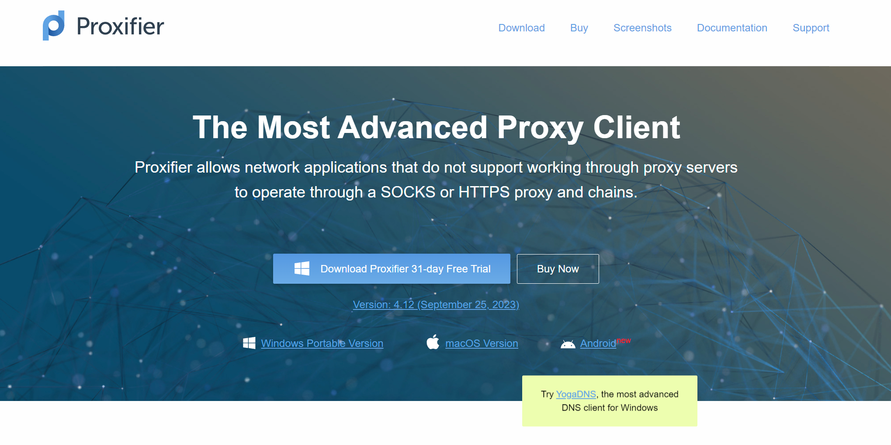


## 安装
先去官网下载[The Most Advanced Proxy Client](https://www.proxifier.com/)安装版

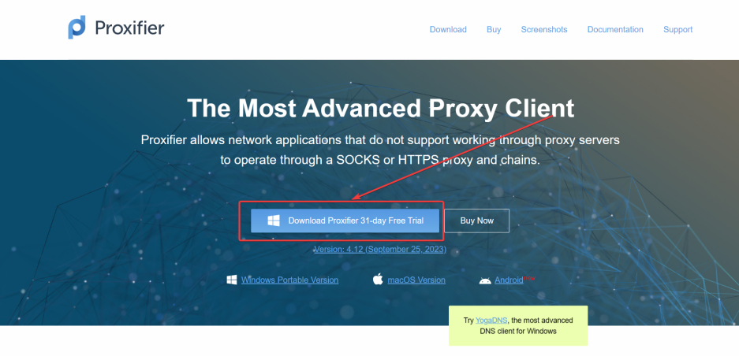

我这里使用的标准版即安装版，双击启动安装包

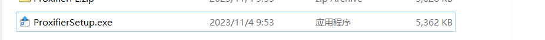

中间弹出受否允许更改设备，请选择是，然后进入安装界面

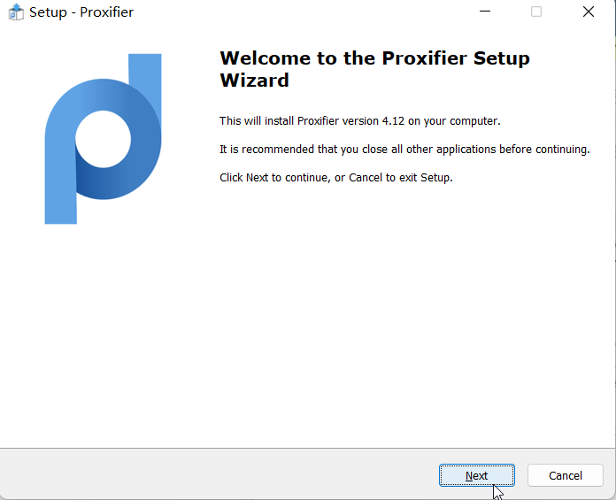

然后点击Next进入下一步

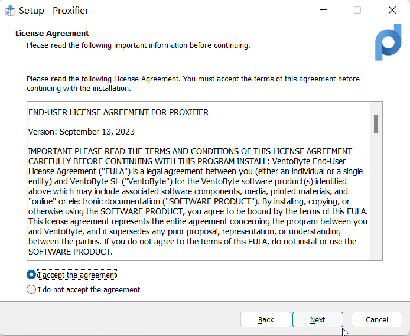

选择同意协议，然后点击Next进入下一步

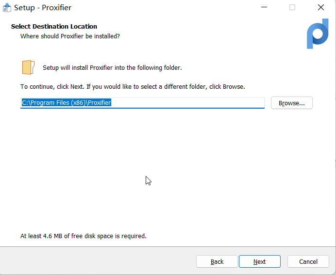

选择安装位置后点击Next进入下一步

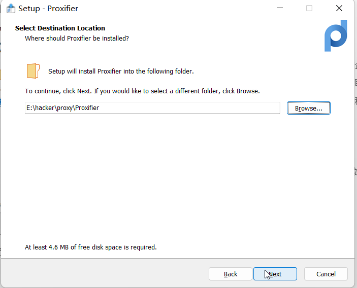

点击Next进入下一步

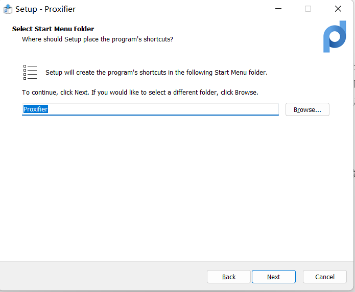

这里默认即可，点击Next进入下一步

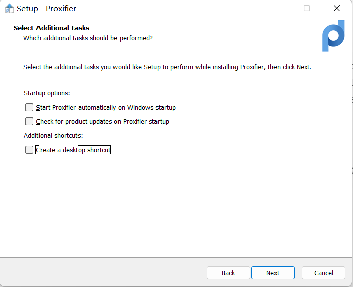

这里按自己的情况勾选，我这里是因为我都不需要，选项介绍：

- 是否让Proxifier开机自启动
- 检查Proxifier的更新
- 在桌面创建一个Proxifier的快捷方式

选择完后点击Next

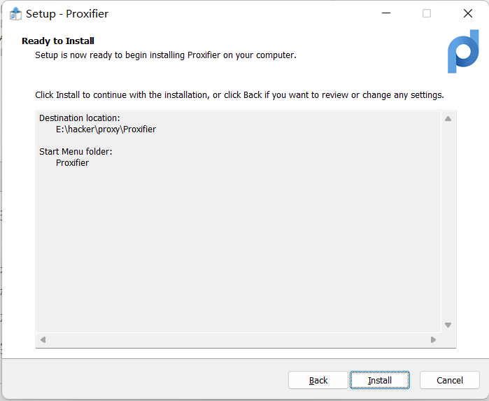

点击install进行安装操作

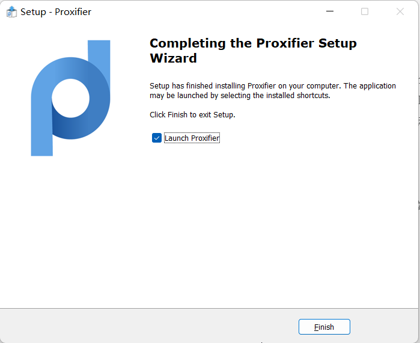

点击Finish完成安装并启动Proxifier

## 激活Proxifier
这东西是要购买的，所以这里得给Proxifier注册一下

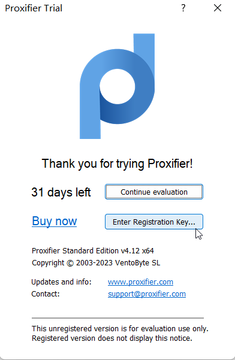

点击Enter Registration key..进入注册界面

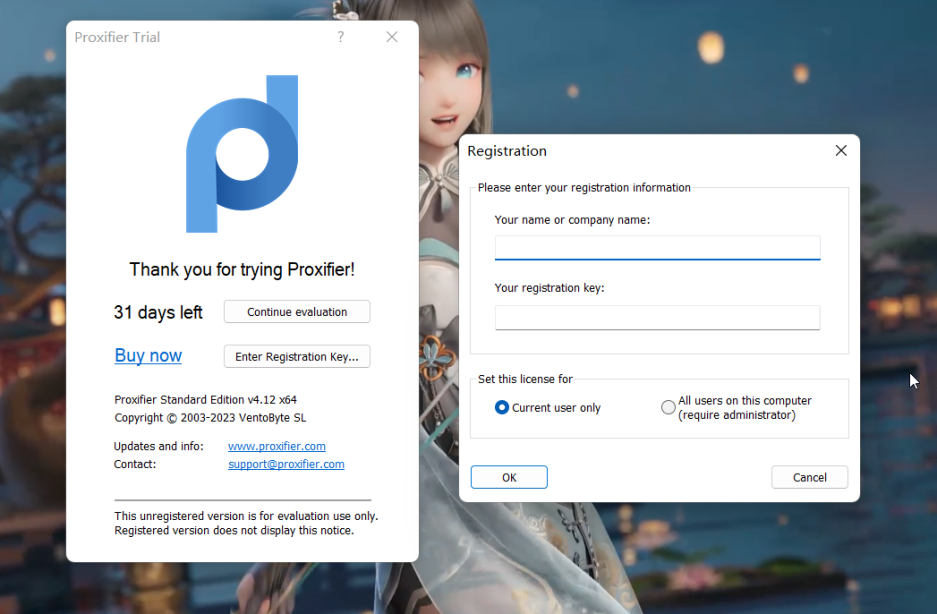

- 上面的是注册使用的用户名
- 下面的是注册使用key

下面是一些key

>PS:尽量使用4.x系列

- standard(标准版)
```
4MHDA-C3FNN-EV6YH-ZENEQ-5A2CP
YHAEF-HWLHS-CQR2A-ZENEQ-35H26
987NH-LYFSC-L4V37-PWN3R-PWE7F
CVYAW-WWVJD-8LA2Y-PWN3R-CZA82
TET7R-EY3CC-4E43T-H0NUS-XQCS9
G8E33-937CU-WM3YE-H0NUS-W236X
NRNQ9-KWN42-PSU2N-CYBER-HCEB7
GG2U7-5WH8W-TZF22-CYBER-BGTY3
S4EMQ-NYMZF-LFT3E-ARSEN-SNZLF
ATV34-T2W3Y-WHNWV-ARSEN-AJJ4L
5EZ8G-C3WL5-B56YG-SCXM9-6QZAP
```

- portable(便携版即免安装版)
```
YYEQ8-PYURB-PVJ3E-ZENEQ-6KCYC
V4FRJ-JYBNC-X4P3F-ZENEQ-G5YNE
L6Z8A-XY2J4-BTZ3P-ZZ7DF-A2Q9C
```

- macos
```
87PZC-V3C3H-GTLYP-ZENEQ-2GJLT
NBBCX-D242M-F97WB-ZENEQ-7VH3H
P427L-9Y552-5433E-8DSR3-58Z68
```

### 注册key的使用
随便找一个，比如我这里 `4MHDA-C3FNN-EV6YH-ZENEQ-5A2CP`

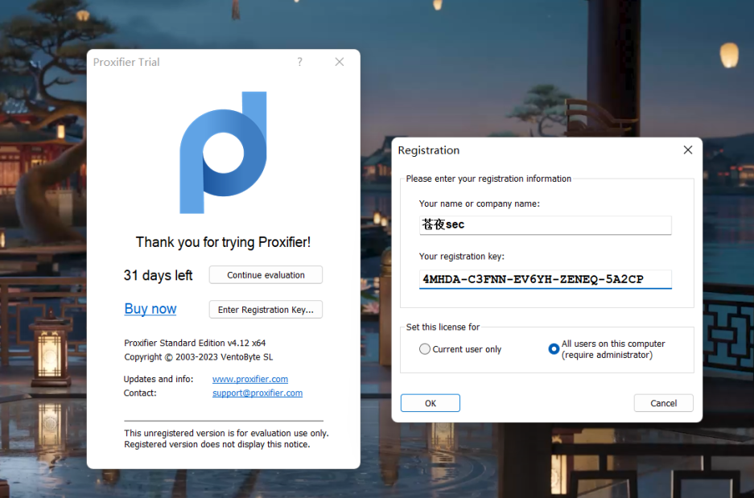

注册时有选项，问你是只为当前用户注册，还是此电脑上的所有用户，看自己选择。选择完成之后点击OK进行注册

> PS：点击完OK后，会弹权限认证，询问是否允许Proxifier更改设备，这个时候请选择是
> 
> 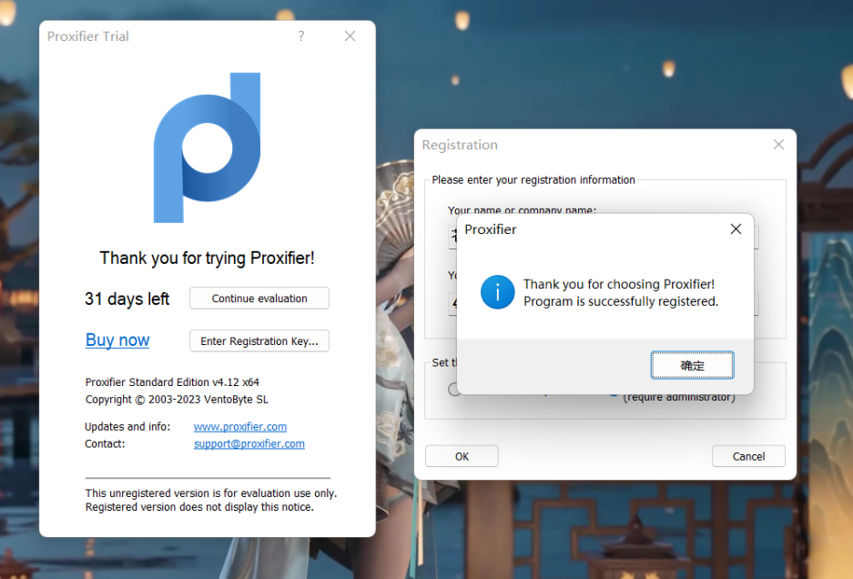

上面的图就是成功了的界面，点击确定后就可以快乐的使用Proxifier了

原文链接：https://www.cnblogs.com/wushiyiwuzhong/p/17809020.html