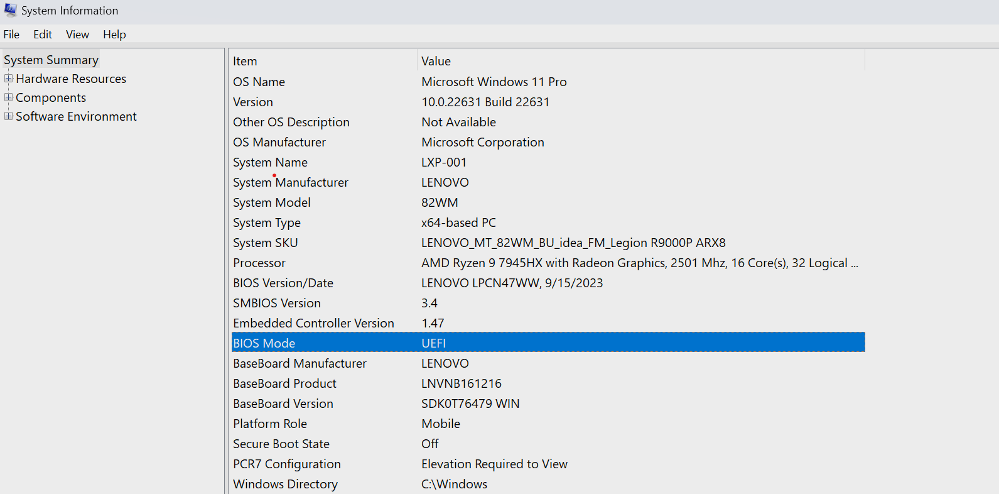
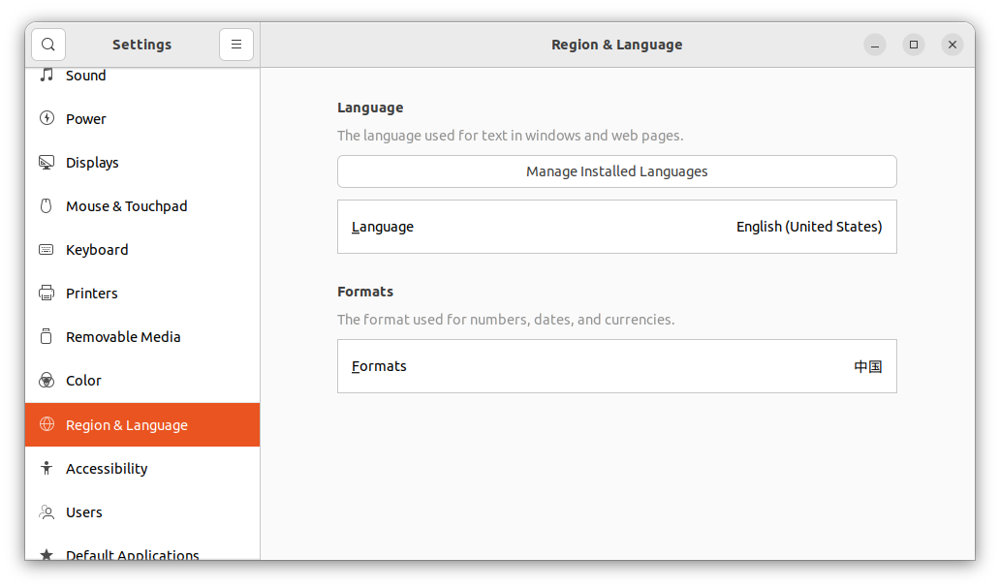
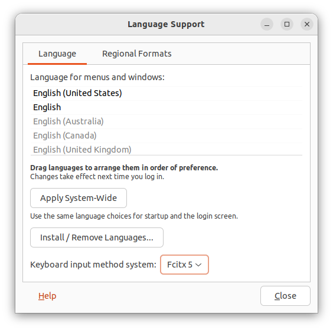
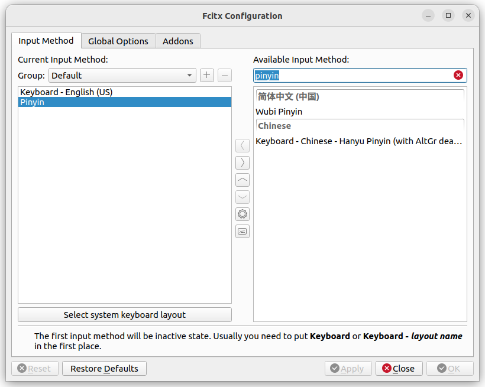

### 一、查看基础环境

#### 1.安装环境和电脑配置

| 配置项 | 配置值 |
| -------- | -------- |
| 操作系统 | Windows 11 |
| 处理器 | AMD Ryzen 9 7945HX |
| 内存 | 16.00GB |
| 硬盘 | 1TB SSD |
| 显卡 |  4060 |

#### 2.查看电脑是否支持UEFI启动
win+s打开搜索，输入System Information，点击运行,如下图所示，如果BIOS Mode为UEFI，则支持UEFI启动，可进行下一步。



注:
- 部分主板不支持UEFI启动，需要使用legacy启动，具体方法可自行搜索。
- 需要一个不小于8GB的U盘，用于制作启动盘。

---

### 二、下载ubuntu22.04以及相关工具

点击下载 [ubuntu-22.04](https://mirrors.bfsu.edu.cn/ubuntu-releases/jammy/ubuntu-22.04.4-desktop-amd64.iso)

下载完成后，使用 [Ventoy](https://www.ventoy.net/cn/index.html)制作启动盘，具体使用方法可参考ventoy官网。

制作完成后，将 **ubuntu-22.04.4-desktop-amd64.iso** 文件移入U盘中。

---

### 三、分区及安装Ubuntu

#### 1.分区

使用[DiskGenius](https://www.diskgenius.com/)软件对U盘进行分区，具体使用方法可参考DiskGenius官网。

给Ubuntu22.04系统分区大小100GB为宜。

#### 2.安装Ubuntu

重新启动电脑，屏幕亮起前按 f2，进入BIOS，关闭安全启动后，退出BIOS。

重新启动电脑，屏幕亮起前按 f12，选择你的U盘启动，选择刚下载的Ubuntu系统，进行安装，后面要注意选择安装位置为新分区就OK。

---

### 四.输入法设置及时区问题

#### 1.输入法设置

安装完成后，会自动进入Ubuntu系统，此时输入法无法输入中文，需要需要安装 fcitx5 .

* 通过命令安装 fcitx5：
```shell
sudo apt install -y fcitx5 fcitx5-chinese-addons fcitx5-frontend-gtk4
sudo apt remove ibus
sudo apt autoremove
```

* 安装完成后，需要设置输入法，通过 ```Settings``` 进入弹出的窗口中进入到如下设置界面。  
选择左侧```Region & Language```，然后单击```Manage Installed LanguagesSettings```



在弹出的窗口中，选择```Keyboard input method system```，下拉框中选中```fcitx5```



单击```Install/Remove Languages...```在弹出的窗口中把中文加入到列表中  

* 在命令行中输入命令```fcitx5-configtool```进行配置在弹出的```Fcitx Configuration```中把```Pinyin```输入法加入到左侧列表中


由于输入法太多，可以在```Avaliable input method:```输入框中输入```pinyin```进行过滤，最后选中```Pinyin```输入法加入到左侧列表就可以了。

> 至此整个输入法设置完毕，通过```Ctrl + Space```就可以在中文和英文输入法之间进行切换了

#### 2.时区设置

安装完成后，由于一种神秘力量，两系统的时间会掉入[时间黑洞](../Linux-windows双系统时间不一致)，发生错乱，导致时间不一致，无法正常显示，此时建议在```Windows```下进行设置。
